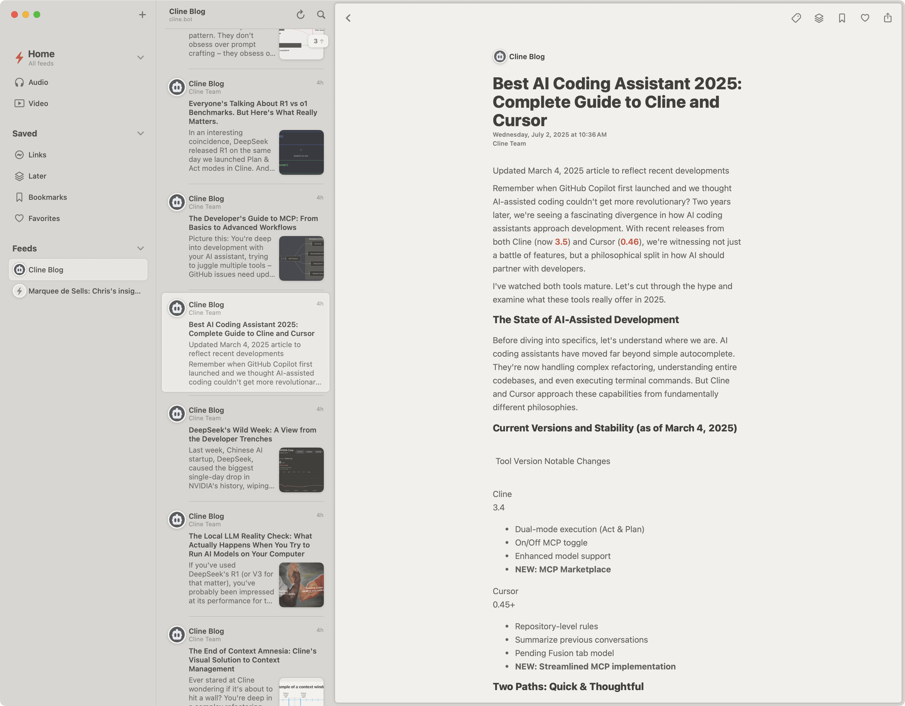

# Cline Blog Feed Server

A Serverpod-based Dart server that provides ATOM feeds for the [Cline AI coding
assistant blog](https://cline.bot/blog). This server automatically scrapes blog
posts from the Cline website and generates RFC 4287-compliant ATOM feeds for
easy consumption by feed readers and other applications.

 *The Cline blog
website that this server scrapes to generate ATOM feeds*

## Overview

The Cline Blog Feed Server bridges the gap between the Cline blog website and
RSS/ATOM feed readers by:

- **Web Scraping**: Automatically fetches and parses blog posts from
  https://cline.bot/blog
- **ATOM Feed Generation**: Creates valid ATOM XML feeds following RFC 4287
  specification
- **Intelligent Caching**: Implements in-memory caching with 1-hour refresh
  intervals to minimize server load
- **Robust Error Handling**: Gracefully handles website changes and network
  issues
- **CORS Support**: Enables cross-origin requests for web applications

## API Endpoints

### ATOM Feed
- **URL**: `/atom.xml`
- **Method**: `GET`
- **Response**: Application/atom+xml
- **Cache**: 1 hour
- **Description**: Returns the latest blog posts in ATOM format

**Example Response Structure**:
```xml
<?xml version="1.0" encoding="UTF-8"?>
<feed xmlns="http://www.w3.org/2005/Atom">
  <title>Cline Blog</title>
  <subtitle>Latest posts from the Cline AI coding assistant blog</subtitle>
  <link href="https://cline.bot/blog" rel="alternate" type="text/html"/>
  <link href="https://cline.bot/blog/feed.xml" rel="self" type="application/atom+xml"/>
  <!-- Blog entries -->
</feed>
```

## Quick Start

### Installation

1. **Clone the repository**:
   ```bash
   git clone <repository-url>
   cd cline_feed_server
   ```

2. **Install dependencies**:
   ```bash
   dart pub get
   ```

3. **Start the server**:
   ```bash
   dart bin/main.dart
   ```

4. **Test the feed**:
   ```bash
   curl http://localhost:8080/atom.xml
   ```

## Development

### Project Structure

```
lib/
├── server.dart                              # Main server configuration
├── src/
│   ├── services/
│   │   ├── blog_scraper.dart               # Web scraper for Cline blog
│   │   └── atom_feed_generator.dart        # ATOM XML generator
│   ├── web/routes/
│   │   ├── feed.dart                       # Feed endpoint handler
│   │   └── root.dart                       # Root page handler
│   └── generated/                          # Serverpod generated files
test/
├── atom_feed_test.dart                     # Feed generation tests
└── integration/                            # Integration tests
```

### Key Components

- **BlogScraper**: Handles web scraping with flexible HTML parsing strategies
- **AtomFeedGenerator**: Creates RFC 4287-compliant ATOM feeds
- **RouteFeed**: HTTP route handler with proper caching and CORS headers
- **Caching System**: Singleton pattern with automatic refresh and error
  recovery

## Architecture

### Data Flow

1. **HTTP Request** → Feed endpoint (`/atom.xml`)
2. **Cache Check** → BlogScraper checks if cache needs updating (1-hour
   interval)
3. **Web Scraping** → Fetches and parses HTML from cline.bot/blog if cache is
   stale
4. **Content Extraction** → Extracts title, URL, excerpt, publish date, and
   author
5. **ATOM Generation** → Creates valid ATOM XML from parsed posts
6. **Response** → Returns feed with proper headers and caching directives

### Scraping Strategy

The BlogScraper uses a multi-layered approach to handle various blog layouts:

1. **Primary Strategy**: Look for semantic HTML elements (`article`, `.post`,
   `.blog-post`)
2. **Fallback Strategy**: Scan for blog post links using `a[href*="/blog/"]`
   patterns
3. **Content Extraction**: Flexible parsing for titles, excerpts, dates, and
   authors
4. **Full Content Fetching**: Retrieves complete article content when available

### Error Handling

- **Graceful Degradation**: Returns cached content if scraping fails
- **Detailed Logging**: Comprehensive error tracking for debugging
- **HTTP Status Codes**: Proper status codes for different error conditions
- **Retry Logic**: Built-in resilience for temporary network issues

## Deployment

### Production Considerations

1. **Monitoring**: Set up logging and monitoring for the scraping process
2. **Rate Limiting**: Consider implementing rate limiting for the feed endpoint
3. **Caching**: The 1-hour cache interval can be adjusted based on blog posting
   frequency
4. **Health Checks**: Monitor the scraping success rate and cache hit ratios
